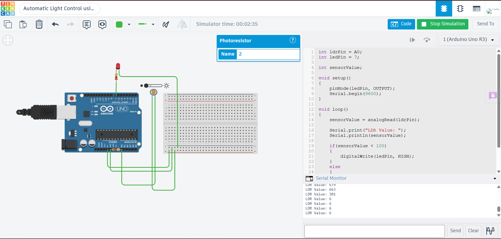

# Automatic Light Control using LDR and LED

## Description

This project demonstrates an automatic lighting system using an LDR (Light Dependent Resistor) and an LED with Arduino Uno in Tinkercad. The LDR continuously monitors the surrounding light intensity. When the environment becomes dark, the Arduino automatically switches ON the LED. When sufficient light is detected, the LED turns OFF. This project illustrates the integration of a sensor with an actuator for simple IoT-based automation.

## Components Required

- Arduino Uno
- LDR (Photoresistor)
- LED
- 220Ω Resistor
- 10kΩ Resistor
- Breadboard
- Jumper Wires

## Circuit Diagram



## Connections

| Component | Arduino Uno |
|-----------|-------------|
| LDR | A0 |
| LED Anode (+) | Digital Pin 7 |
| LED Cathode (-) | 220Ω Resistor → GND |
| LDR Voltage Divider | 5V → LDR → A0 → 10kΩ → GND |

## Working

The Arduino continuously reads the analog value from the LDR connected to analog pin A0. When the light intensity falls below the predefined threshold, the Arduino turns the LED ON. If the light intensity increases above the threshold, the LED turns OFF. The current sensor value is displayed on the Serial Monitor every 500 milliseconds.

## Output

Example:

```
LDR Value: 52
LED ON

LDR Value: 315
LED OFF
```

## Applications

- Automatic Street Lighting
- Smart Home Lighting
- Garden Lighting
- Energy Saving Systems
- Day/Night Detection

## Files

- `ldr_led_automatic_light.ino` – Arduino source code
- `circuit.png` – Tinkercad circuit screenshot