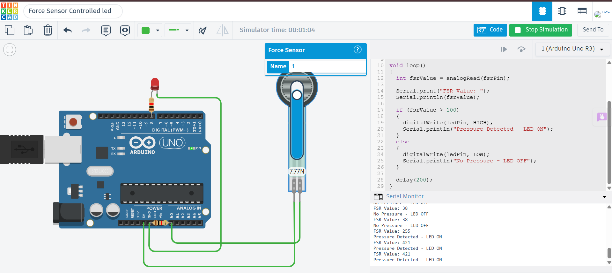

# Force Sensor Controlled LED using Arduino Uno

## Description

This project demonstrates how to control an LED using a Force Sensitive Resistor (FSR) with Arduino Uno in Tinkercad. The FSR detects the amount of pressure applied to its surface. When the applied force exceeds a predefined threshold, the Arduino turns ON the LED as a visual indication. When no significant pressure is detected, the LED remains OFF.

## Components Required

- Arduino Uno
- Force Sensitive Resistor (FSR)
- 10kΩ Resistor
- LED
- 220Ω Resistor
- Breadboard
- Jumper Wires

## Circuit Diagram



## Connections

### Force Sensor (FSR)

| Component | Arduino Uno |
|-----------|-------------|
| One Terminal | 5V |
| Other Terminal | A0 |
| 10kΩ Resistor | Between A0 and GND |

### LED

| Component | Arduino Uno |
|-----------|-------------|
| LED Anode (+) | Digital Pin 8 |
| LED Cathode (-) | 220Ω Resistor → GND |

## Working

The Arduino continuously reads the analog value from the Force Sensitive Resistor connected to analog pin A0. When pressure is applied to the sensor, its resistance changes, resulting in a higher analog reading. If the reading exceeds the threshold value of 100, the Arduino turns the LED ON and displays a pressure detected message on the Serial Monitor. Otherwise, the LED remains OFF.

## Output

Example:

```
FSR Value: 35
No Pressure - LED OFF

FSR Value: 268
Pressure Detected - LED ON
```

## Applications

- Pressure Detection Systems
- Smart Touch Controls
- Security Systems
- Medical Pressure Monitoring
- Robotics and Automation

## Files

- `force_sensor_controlled_led.ino` – Arduino source code
- `circuit.png` – Tinkercad circuit screenshot