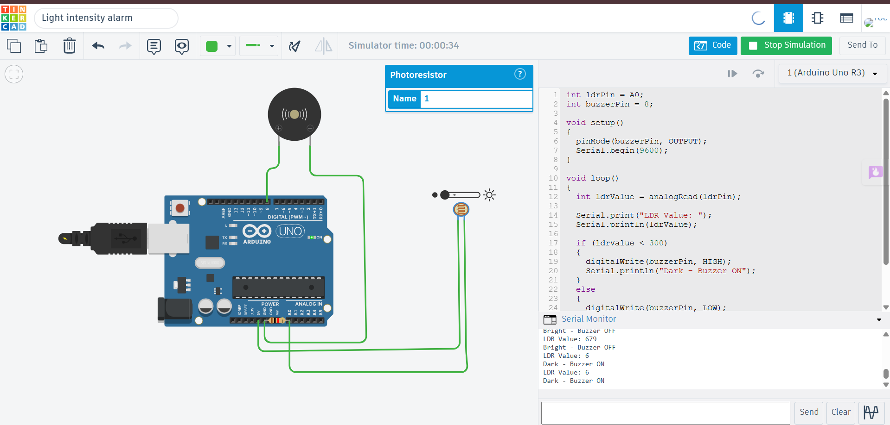

# LDR Darkness Alarm using LDR and Piezo Buzzer

## Description

This project demonstrates a darkness detection alarm using an LDR (Light Dependent Resistor) and a Piezo Buzzer with Arduino Uno in Tinkercad. The LDR continuously measures the surrounding light intensity. When the environment becomes dark and the light intensity falls below a predefined threshold, the Arduino activates the buzzer to provide an audible alert. When sufficient light is available, the buzzer remains OFF.

## Components Required

- Arduino Uno
- LDR (Photoresistor)
- Piezo Buzzer
- 10kΩ Resistor
- Breadboard
- Jumper Wires

## Circuit Diagram



## Connections

### LDR

| Component | Arduino Uno |
|-----------|-------------|
| LDR | A0 |
| Voltage Divider | 5V → LDR → A0 → 10kΩ → GND |

### Piezo Buzzer

| Buzzer | Arduino Uno |
|---------|-------------|
| Positive (+) | Digital Pin 8 |
| Negative (-) | GND |

## Working

The Arduino continuously reads the analog value from the LDR connected to analog pin A0. If the light intensity falls below the threshold value of 300, the Arduino activates the piezo buzzer to indicate a dark environment. When the light intensity rises above the threshold, the buzzer is turned OFF. The LDR readings and system status are displayed on the Serial Monitor.

## Output

Example:

```
LDR Value: 185
Dark - Buzzer ON

LDR Value: 640
Bright - Buzzer OFF
```

## Applications

- Automatic Darkness Alarm
- Night Security Systems
- Smart Lighting Alerts
- Energy Management
- Home Automation

## Files

- `ldr_buzzer_darkness_alarm.ino` – Arduino source code
- `circuit.png` – Tinkercad circuit screenshot