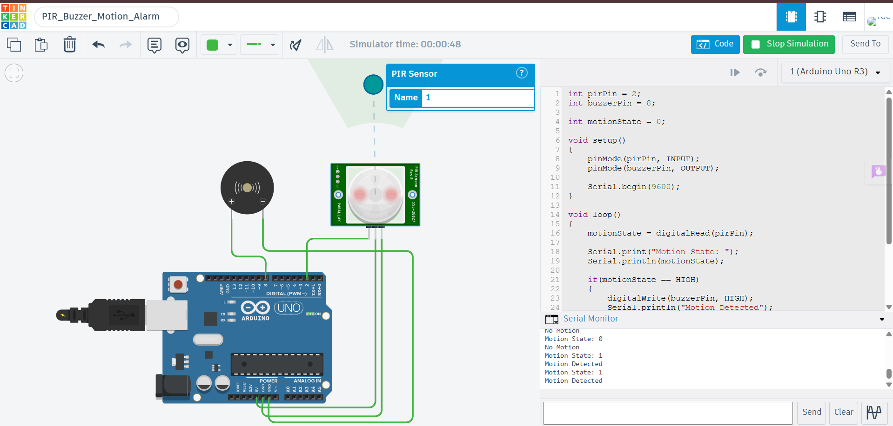

# PIR Motion Sensor with Buzzer Alarm using Arduino Uno

## Description

This project demonstrates a simple motion detection alarm system using a PIR (Passive Infrared) Motion Sensor and a Buzzer with Arduino Uno in Tinkercad. The PIR sensor detects movement within its sensing range. When motion is detected, the Arduino activates the buzzer to produce an alarm sound. If no motion is detected, the buzzer remains OFF.

## Components Required

- Arduino Uno
- PIR Motion Sensor
- Piezo Buzzer
- Jumper Wires

## Circuit Diagram



## Connections

| Component | Arduino Uno |
|-----------|-------------|
| PIR VCC | 5V |
| PIR GND | GND |
| PIR OUT | Digital Pin 2 |
| Buzzer (+) | Digital Pin 8 |
| Buzzer (-) | GND |

## Working

The PIR sensor continuously monitors its surroundings for motion. The Arduino reads the digital output from the PIR sensor through pin D2. When motion is detected, the sensor outputs HIGH, causing the Arduino to turn the buzzer ON. When no motion is detected, the sensor outputs LOW, and the buzzer remains OFF. The sensor status is also displayed on the Serial Monitor.

## Output

Example:

```
Motion State: 1
Motion Detected

Motion State: 0
No Motion
```

## Applications

- Home Security Systems
- Intruder Detection
- Smart Door Alerts
- Motion-Activated Alarm Systems
- Office Security

## Files

- `pir_buzzer_motion_alarm.ino` – Arduino source code
- `circuit.png` – Tinkercad circuit screenshot