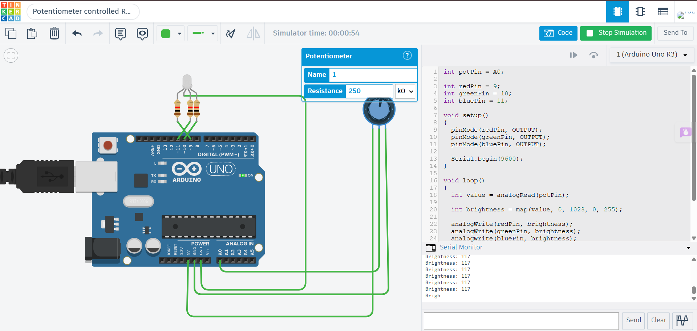

# Potentiometer Controlled RGB LED using Arduino Uno

## Description

This project demonstrates how to control the brightness of a common cathode RGB LED using a Potentiometer with Arduino Uno in Tinkercad. The Arduino reads the analog value from the potentiometer and maps it to a PWM value between 0 and 255. This PWM value is applied equally to the red, green, and blue channels, allowing the overall brightness of the RGB LED to be adjusted by rotating the potentiometer.

## Components Required

- Arduino Uno
- Potentiometer (10kΩ)
- Common Cathode RGB LED
- 3 × 220Ω Resistors
- Jumper Wires

## Circuit Diagram



## Connections

### Potentiometer

| Potentiometer Pin | Arduino Uno |
|-------------------|-------------|
| Left Pin | 5V |
| Middle Pin (Wiper) | A0 |
| Right Pin | GND |

### RGB LED

| RGB LED Pin | Arduino Uno |
|-------------|-------------|
| Red | Digital Pin 9 (PWM) |
| Green | Digital Pin 10 (PWM) |
| Blue | Digital Pin 11 (PWM) |
| Common Cathode | GND |

> Connect a 220Ω resistor in series with each RGB LED color pin.

## Working

The Arduino continuously reads the analog value from the potentiometer connected to analog pin A0. The value (0–1023) is mapped to a PWM value (0–255). The PWM value is applied equally to the red, green, and blue channels of the RGB LED, changing its overall brightness. The current brightness value is displayed on the Serial Monitor.

## Output

Example:

```
Brightness: 0
Brightness: 85
Brightness: 170
Brightness: 255
```

## Applications

- Smart Lighting Systems
- LED Brightness Control
- Mood Lighting
- Home Automation
- Decorative Lighting

## Files

- `potentiometer_controlled_rgb.ino` – Arduino source code
- `circuit.png` – Tinkercad circuit screenshot