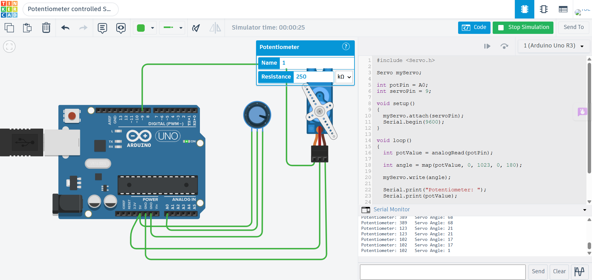

# Potentiometer Controlled Servo using Arduino Uno

## Description

This project demonstrates how to control a Servo Motor using a Potentiometer with Arduino Uno in Tinkercad. The potentiometer acts as an analog input device, allowing the user to adjust the servo motor's angle by rotating the knob. The Arduino reads the potentiometer value, maps it to an angle between 0° and 180°, and positions the servo accordingly.

## Components Required

- Arduino Uno
- Potentiometer (10kΩ)
- Servo Motor
- Jumper Wires

## Circuit Diagram



## Connections

### Potentiometer

| Potentiometer Pin | Arduino Uno |
|-------------------|-------------|
| Left Pin | 5V |
| Middle Pin (Wiper) | A0 |
| Right Pin | GND |

### Servo Motor

| Servo Pin | Arduino Uno |
|------------|-------------|
| Signal | Digital Pin 9 |
| VCC | 5V |
| GND | GND |

## Working

The Arduino continuously reads the analog value from the potentiometer connected to analog pin A0. The value ranges from 0 to 1023 and is mapped to a servo angle between 0° and 180°. The servo motor rotates smoothly to the corresponding angle as the potentiometer is turned. Both the potentiometer value and the servo angle are displayed on the Serial Monitor.

## Output

Example:

```
Potentiometer: 120   Servo Angle: 21
Potentiometer: 512   Servo Angle: 90
Potentiometer: 930   Servo Angle: 163
```

## Applications

- Robotic Arm Control
- Camera Pan-Tilt Systems
- Position Control
- Industrial Automation
- Smart Home Devices

## Files

- `potentiometer_controlled_servo.ino` – Arduino source code
- `circuit.png` – Tinkercad circuit screenshot