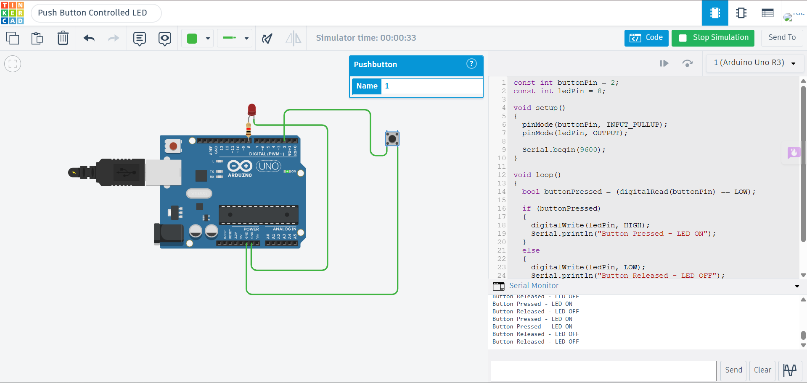

# Push Button Controlled LED using Arduino Uno

## Description

This project demonstrates how to control an LED using a Push Button with Arduino Uno in Tinkercad. The push button acts as a digital input device. When the button is pressed, the Arduino turns the LED ON. When the button is released, the LED turns OFF. The button status is also displayed on the Serial Monitor.

## Components Required

- Arduino Uno
- Push Button
- LED
- 220Ω Resistor
- Jumper Wires

> **Note:** The Arduino's internal pull-up resistor (`INPUT_PULLUP`) is used, so no external resistor is required for the push button.

## Circuit Diagram



## Connections

### Push Button

| Push Button | Arduino Uno |
|-------------|-------------|
| One Terminal | Digital Pin 2 |
| Opposite Terminal | GND |

### LED

| LED | Arduino Uno |
|-----|-------------|
| Anode (+) | Digital Pin 8 |
| Cathode (-) | 220Ω Resistor → GND |

## Working

The Arduino continuously monitors the push button connected to digital pin 2. Since `INPUT_PULLUP` is enabled, the input remains HIGH when the button is not pressed and becomes LOW when the button is pressed. When a button press is detected, the Arduino turns the LED ON and displays the message **"Button Pressed - LED ON"** on the Serial Monitor. When the button is released, the LED turns OFF and the message **"Button Released - LED OFF"** is displayed.

## Output

Example:

```
Button Released - LED OFF
Button Released - LED OFF

Button Pressed - LED ON
Button Pressed - LED ON

Button Released - LED OFF
```

## Applications

- User Input Systems
- Home Automation Controls
- Electronic Voting Systems
- Smart Switches
- Industrial Control Panels

## Files

- `push_button_led_control.ino` – Arduino source code
- `circuit.png` – Tinkercad circuit screenshot