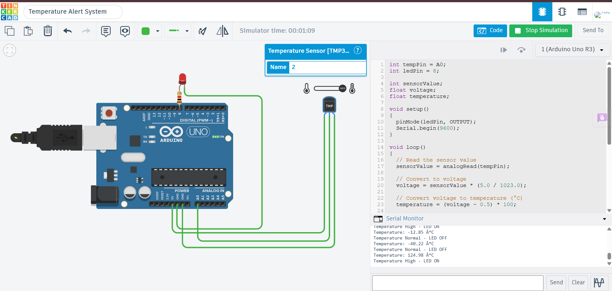

# Temperature Alert System using TMP36 Sensor and LED

## Description

This project demonstrates a temperature monitoring and alert system using a TMP36 Temperature Sensor and an LED with Arduino Uno in Tinkercad. The TMP36 sensor continuously measures the ambient temperature. When the temperature exceeds the predefined threshold of 30°C, the Arduino automatically turns ON the LED as a visual alert. When the temperature falls below the threshold, the LED turns OFF.

## Components Required

- Arduino Uno
- TMP36 Temperature Sensor
- LED
- 220Ω Resistor
- Jumper Wires

## Circuit Diagram



## Connections

| Component | Arduino Uno |
|-----------|-------------|
| TMP36 VCC | 5V |
| TMP36 GND | GND |
| TMP36 Signal | A0 |
| LED Anode (+) | Digital Pin 8 |
| LED Cathode (-) | 220Ω Resistor → GND |

## Working

The Arduino continuously reads the analog voltage from the TMP36 sensor connected to analog pin A0. The measured voltage is converted into temperature in degrees Celsius. If the temperature exceeds 30°C, the Arduino turns ON the LED to indicate a high-temperature condition. Otherwise, the LED remains OFF. The temperature reading and system status are displayed on the Serial Monitor every second.

## Output

Example:

```
Temperature: 27.6 °C
Temperature Normal - LED OFF

Temperature: 34.2 °C
Temperature High - LED ON
```

## Applications

- Temperature Monitoring
- Overheat Warning Systems
- Smart Home Automation
- Industrial Temperature Alerts
- Environmental Monitoring

## Files

- `temperature_led_alert_system.ino` – Arduino source code
- `circuit.png` – Tinkercad circuit screenshot