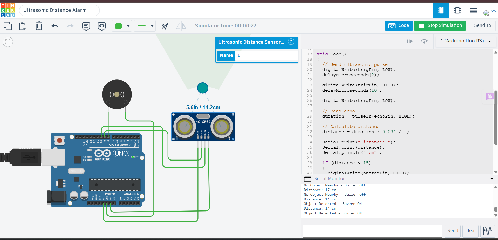

# Ultrasonic Distance Alarm using Ultrasonic Sensor and Piezo Buzzer

## Description

This project demonstrates a distance-based alarm system using an HC-SR04 Ultrasonic Sensor and a Piezo Buzzer with Arduino Uno in Tinkercad. The ultrasonic sensor continuously measures the distance to nearby objects. When an object comes within 15 cm of the sensor, the Arduino activates the buzzer to alert the user. If no object is detected within the specified range, the buzzer remains OFF.

## Components Required

- Arduino Uno
- HC-SR04 Ultrasonic Sensor
- Piezo Buzzer
- Jumper Wires

## Circuit Diagram



## Connections

### Ultrasonic Sensor

| HC-SR04 Pin | Arduino Uno |
|--------------|-------------|
| VCC | 5V |
| GND | GND |
| Trig | Digital Pin 9 |
| Echo | Digital Pin 10 |

### Piezo Buzzer

| Buzzer | Arduino Uno |
|---------|-------------|
| Positive (+) | Digital Pin 8 |
| Negative (-) | GND |

## Working

The Arduino triggers the HC-SR04 Ultrasonic Sensor to measure the distance of nearby objects. The measured distance is displayed on the Serial Monitor. If an object is detected within 15 cm, the Arduino turns the buzzer ON to provide an audible alert. If the object is farther than 15 cm, the buzzer remains OFF.

## Output

Example:

```
Distance: 10 cm
Object Detected - Buzzer ON

Distance: 35 cm
No Object Nearby - Buzzer OFF
```

## Applications

- Obstacle Detection
- Parking Assistance Systems
- Smart Security Systems
- Robot Navigation
- Distance Monitoring

## Files

- `ultrasonic_distance_alarm.ino` – Arduino source code
- `circuit.png` – Tinkercad circuit screenshot