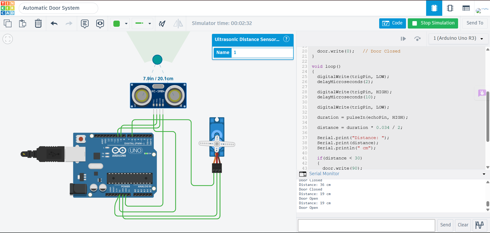

# Automatic Door System using Ultrasonic Sensor and Servo Motor

## Description

This project demonstrates an automatic door system using an Ultrasonic Sensor (HC-SR04) and a Servo Motor with Arduino Uno in Tinkercad. The ultrasonic sensor continuously measures the distance of nearby objects. When an object is detected within 30 cm, the Arduino rotates the servo motor to open the door. If no object is detected within the specified range, the servo motor returns to its initial position, closing the door.

## Components Required

- Arduino Uno
- Ultrasonic Sensor (HC-SR04)
- Servo Motor
- Jumper Wires

## Circuit Diagram



## Connections

### Ultrasonic Sensor

| HC-SR04 Pin | Arduino Uno |
|--------------|-------------|
| VCC | 5V |
| GND | GND |
| Trig | Digital Pin 9 |
| Echo | Digital Pin 10 |

### Servo Motor

| Servo Pin | Arduino Uno |
|------------|-------------|
| Signal | Digital Pin 6 |
| VCC | 5V |
| GND | GND |

## Working

The Arduino triggers the ultrasonic sensor to measure the distance to nearby objects. The measured distance is displayed on the Serial Monitor. If an object is detected within 30 cm, the Arduino rotates the servo motor to 90°, simulating an open door. When the object moves away, the servo returns to 0°, closing the door automatically.

## Output

Example:

```
Distance: 18 cm
Door Open

Distance: 54 cm
Door Closed
```

## Applications

- Automatic Door Systems
- Smart Home Entrance
- Contactless Door Control
- Office Access Systems
- IoT Automation Projects

## Files

- `ultrasonic_servo_automatic_door.ino` – Arduino source code
- `circuit.png` – Tinkercad circuit screenshot